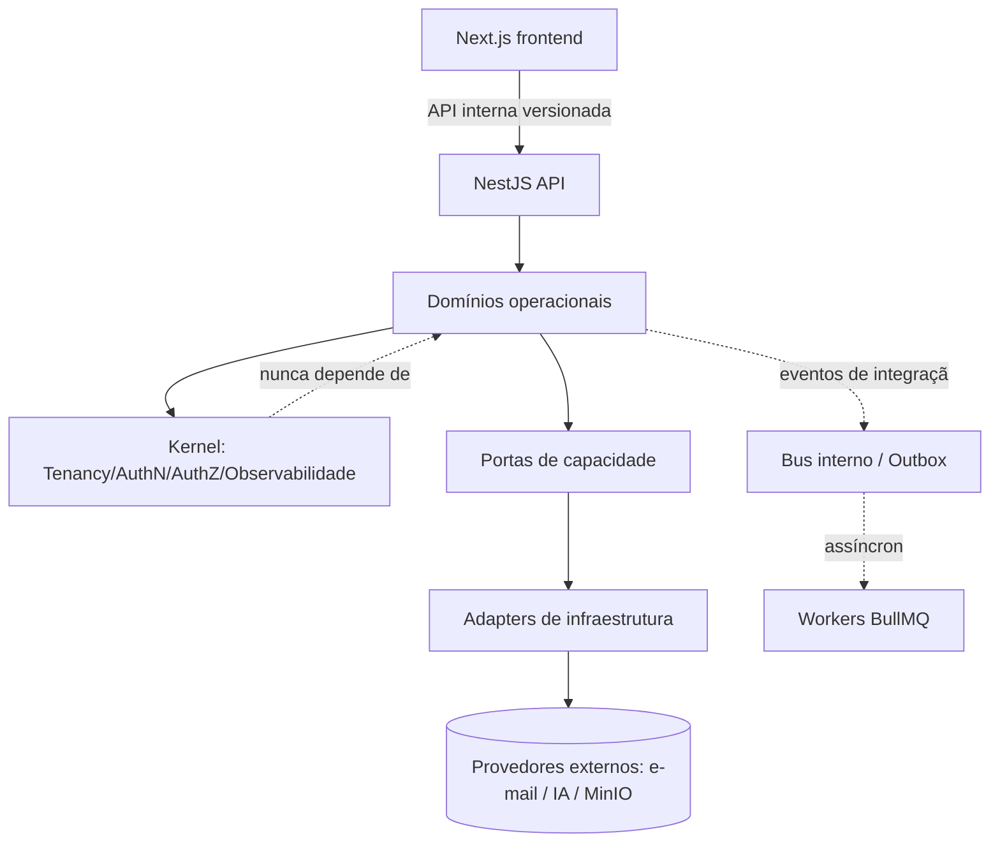
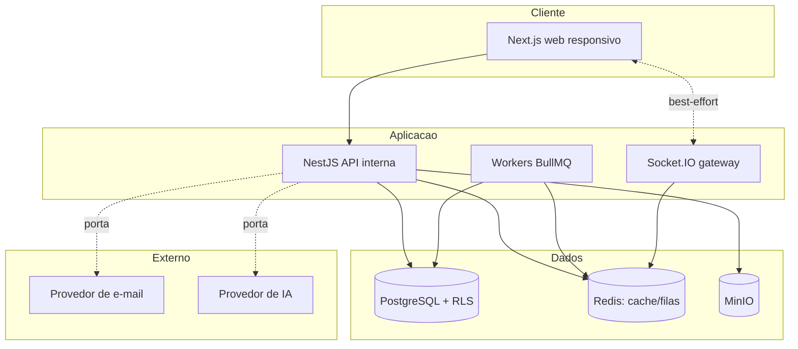

# Architecture Spine — Giraffe CRM · Fase 1

## Design Paradigm

**Monólito modular** com **domínio no centro** (ports & adapters). Backend NestJS organizado em **módulos por domínio**, todos assentados sobre um **kernel transversal mínimo**; frontend Next.js separado, consumindo apenas a API interna. Dependências externas (e-mail, IA, storage) ficam atrás de **portas separadas por capacidade**; o domínio não conhece SDKs de infraestrutura.

- **Kernel (transversal):** Tenancy (Organização), AuthN/Sessão, AuthZ (CASL), Observabilidade.
- **Domínios operacionais:** Pipe (+Fase, +Card), Database (+Registro), Formulário, Automação, E-mail, IA, Tarefa/Solicitação, Notificação, Relatório, Perfil, Painel Admin.
- **Plataforma:** escopo acima da Organização (Super Admin — fronteira preparada, sem operação na Fase 1).

## Invariants & Rules

Direção de dependência (quem pode depender de quem):

### AD-1 — Paradigma: monólito modular, fronteiras de domínio invariantes
- **Binds:** todo o backend
- **Prevents:** erosão de fronteiras (Pipe≠Database, Card≠Registro, Fase≠Status, Plataforma≠Organização)
- **Rule:** fronteiras de domínio são invariante, não convenção; distinções estruturais do PRD são preservadas no código.

### AD-2 — Frontend/backend separados; API interna
- **Binds:** Next.js, NestJS
- **Prevents:** regra de negócio vazando para o frontend; exposição pública da API
- **Rule:** o frontend consome apenas a API interna do NestJS; nenhuma regra de domínio no frontend; a API não é pública (Fase 2), mas exige authn, authz, validação, isolamento por Organização e contratos estáveis.

### AD-3 — Monorepo: compartilhamento restrito
- **Binds:** monorepo front↔back
- **Prevents:** acoplamento do frontend a internals do backend
- **Rule:** compartilhar apenas contratos públicos internos, schemas de validação e tipos utilitários; entidades de domínio, modelos de ORM e internals nunca são expostos ao frontend.

### AD-4 — Kernel mínimo
- **Binds:** kernel transversal
- **Prevents:** kernel virar módulo genérico com regra de negócio
- **Rule:** o kernel concentra só identidade/sessão, contexto de Organização, autorização, observabilidade e abstrações comuns realmente necessárias; regra de negócio vive nos domínios.

### AD-5 — Regras de dependência entre módulos
- **Binds:** todos os módulos; entidades de domínio
- **Prevents:** acoplamento oculto e dependência de infra no domínio
- **Rule:** (1) nenhum módulo acessa repositório/tabela interna de outro; (2) comunicação síncrona por contratos de aplicação explícitos; (3) assíncrona por eventos definidos; (4) entidades de domínio não dependem de NestJS, Prisma, CASL ou infraestrutura; dependência sempre em direção ao kernel.

### AD-6 — Isolamento multi-tenant (o invariante-mãe) `[ADOPTED]`
- **Binds:** todo dado operacional (NFR-3)
- **Prevents:** vazamento de dados entre Organizações
- **Rule:** PostgreSQL compartilhado com `orgId` em todo dado organizacional; escopo de Organização imposto centralmente com **deny-by-default** + **RLS** do PostgreSQL como reforço. O papel da aplicação não tem `BYPASSRLS` nem depende de proprietário; `FORCE ROW LEVEL SECURITY` nas tabelas organizacionais; contexto de Org definido **dentro da transação** (`set_config(...,true)`), nunca global no pool; papéis de banco separados (aplicação com RLS obrigatório; migrations/manutenção com privilégio controlado; nunca papel administrativo em requisição normal).

### AD-7 — Modelo de identidade e Membership (Forma B) `[ADOPTED]`
- **Binds:** Account/User, Membership, Sessão
- **Prevents:** confusão entre identidade global e vínculo organizacional; acesso cross-tenant por `orgId` forjado
- **Rule:** Account/User é identidade global (Plataforma); Membership é o vínculo usuário↔Organização (papel + estado); `activeOrganizationId` é contexto mutável da sessão/requisição, nunca autorização suficiente. `orgId` fica em Membership e nos dados organizacionais, nunca na conta global. Toda requisição revalida no servidor que a Membership continua ativa; nunca confiar no `orgId` do frontend.

### AD-8 — Propagação do contexto de Organização
- **Binds:** filas/jobs, eventos, cache, arquivos, notificações, auditoria, logs
- **Prevents:** vazamento de tenant fora do caminho síncrono de banco
- **Rule:** o contexto de Organização acompanha todo processamento assíncrono e transversal, não só as queries.

### AD-9 — Autorização (CASL) composta com tenancy
- **Binds:** todos os canais de acesso; a matriz de permissões (OQ-1..4, Produto)
- **Prevents:** herança de acesso entre Organizações; concessão implícita da Plataforma; confiança no frontend
- **Rule:** CASL com abilities por `action + subject + conditions` (Membership, papel e atributos do recurso alimentam a política; Pipe/Card/Database/Registro etc. são subjects); ausência de regra = negado. Toda checagem ocorre dentro de escopo de Org resolvido; Plataforma não concede acesso implícito a dados de Org. Backend é a autoridade; authz aplicada em comandos/consultas, WebSocket, jobs/filas, eventos, arquivos e ações de Automação/IA. Principais: usuário autenticado, processo/job, Automação, serviço de Plataforma — cada um carrega Organização, ator/origem e permissões. Remoção/suspensão/mudança de papel invalida acesso e abilities em cache, limpa Org ativa quando inacessível; sem permissões duradouras em tokens. Operações sensíveis exigem step-up/reautenticação (quais = Produto+Segurança).

### AD-10 — Propriedade de dados
- **Binds:** todas as entidades
- **Prevents:** dado operacional sem dono claro
- **Rule:** Organização é dona do dado operacional (e da Auditoria administrativa); Plataforma é dona de Conta/Identidade, Sessão e logs técnicos (estes com contexto de Org quando aplicável). Indicadores/cache de Relatório são derivados, nunca fonte de verdade.

### AD-11 — Referências por identificador estável e integridade dupla
- **Binds:** toda referência entre entidades (OQ-18/23/26/29)
- **Prevents:** cruzamento de tenant e referências frágeis por nome
- **Rule:** referência por ID estável, com integridade referencial + de tenant; relações validam simultaneamente existência do alvo, mesma Organização e autorização do principal; unicidade funcional é org-scoped (salvo identificadores globais explícitos). Card↔Registro, Tarefa↔Card, E-mail↔Card e Ação↔Template referenciam por ID tenant-safe; **cardinalidades/obrigatoriedades são de Produto**; nenhuma relação é materializada só para "preparar o futuro".

### AD-12 — Integridade e versionamento de Formulário/Campo
- **Binds:** Formulário, Campo, Registro
- **Prevents:** perda/deslocamento de valores ao evoluir Formulários
- **Rule:** Formulário e Campo têm ID estável; valores não dependem do nome visual; renomear não perde/desloca valores; alterar/remover Campo preserva o histórico dos Registros; a execução/leitura registra a versão da definição utilizada.

### AD-13 — Mutação de estado por eventos
- **Binds:** todos os domínios
- **Prevents:** efeitos dispersos e escritas cruzadas entre domínios
- **Rule:** mutação passa pela aplicação do domínio dono (nenhum módulo escreve em repo de outro); efeitos transversais derivam de eventos. Distinguir evento de domínio (fato interno) de evento de integração (contrato estável para outros módulos); publicar efeitos só após a transação (alteração principal + registro do evento confiável de forma atômica — ex.: Outbox), processando o assíncrono depois. Eventos/consumidores carregam id único, Organização, ator/origem, timestamp, tipo+versão, correlação e são idempotentes. Nem todo evento gera Histórico/Notificação/Automação: cada consumidor só reage quando o comportamento for aprovado por Produto.

### AD-14 — Fonte de verdade única
- **Binds:** todos os dados
- **Prevents:** múltiplas verdades divergentes
- **Rule:** cada conceito tem um domínio proprietário e uma fonte autoritativa; projeções, caches, indicadores e índices de busca são derivados e reconstruíveis.

### AD-15 — Quatro trilhas separadas
- **Binds:** Histórico do Card, Log operacional, Auditoria administrativa, Log técnico
- **Prevents:** conflação de trilhas; log técnico despejado no Histórico
- **Rule:** as quatro trilhas têm armazenamento, acesso e retenção próprios; nenhuma é fonte de verdade do domínio; log técnico é de Plataforma com contexto de Org e nunca aparece no Histórico do Card.

### AD-16 — Concorrência
- **Binds:** domínios com mutação concorrente
- **Prevents:** sobrescrita silenciosa
- **Rule:** alterações simultâneas não podem sobrescrever dados silenciosamente; o mecanismo de controle de concorrência é definido por domínio (deferred).

### AD-17 — Alteração destrutiva e migrations
- **Binds:** evolução de schema/dados
- **Prevents:** perda de dados em mudanças estruturais
- **Rule:** nenhuma alteração destrutiva sem estratégia aprovada de preservação/transformação/recuperação ou exclusão intencional autorizada; toda migration exige estratégia de roll-forward, recuperação ou restauração, compatibilidade entre versões durante o deploy e validação de isolamento por Organização; executadas como etapa controlada, não por cada container.

### AD-18 — Motor de Automação
- **Binds:** Automação (FR-21..23), BullMQ/Redis; catálogo e comportamentos (OQ-24/25/16, Produto)
- **Prevents:** execução autônoma incorreta; ciclos; execução sobre payload não confiável
- **Rule:** execução assíncrona em fila, disparada por eventos de integração pós-transação; só Automações ativas avaliadas; ao executar, revalidar no servidor Organização, Automação ativa, versão, permissões do principal e existência dos recursos (não confiar no payload). Motor Evento→Condição→Ação rastreável, ações internas; catálogo/comportamentos = Produto. Prevenção de ciclos é invariante: `executionChainId`, evento causador, profundidade máxima, Automações visitadas e deduplicação por evento/Automação. Principal Automação tem capacidades explícitas deny-by-default; não herda indefinidamente as permissões do criador; a definição é versionada e a execução registra a versão usada.

### AD-19 — Semântica de entrega assíncrona
- **Binds:** filas, consumidores, Ações
- **Prevents:** efeito duplicado por reentrega
- **Rule:** a fila pode reentregar; consumidores e Ações são idempotentes com chave de deduplicação; falhas têm retry limitado, backoff, timeout, estado final, reprocessamento controlado e alerta quando não recuperável.

### AD-20 — IA nunca produz efeito operacional direto
- **Binds:** IA (FR-26, NFR-17)
- **Prevents:** ação operacional autônoma da IA
- **Rule:** a saída aceita pela IA não executa o efeito; ela gera um comando separado, autorizado e auditável (enviar e-mail, alterar dado etc.); a trilha de Execuções é sanitizada (id, Org, Automação+versão, evento causador, tentativa, duração, resultado, erro sem segredos/PII).

### AD-21 — Tempo real best-effort
- **Binds:** Socket.IO
- **Prevents:** dependência da correção no canal; vazamento por evento
- **Rule:** tempo real é transporte derivado; a fonte persistida é a autoridade; indisponibilidade não perde estado e a reconexão relê a fonte; o cliente não presume ter recebido todos os eventos. Ao trocar de Organização: cancelar inscrições, limpar contexto do cliente, revalidar Membership no servidor, então reinscrever. Eventos carregam o mínimo (tipo, recurso, versão/momento, correlação), sem conteúdo pessoal/segredos/objetos completos; o frontend recebe contratos de atualização de UI versionados (não eventos de domínio) e busca dados pela API. Revalidar autorização ao conectar, assinar canal, trocar Org e após mudança de Membership/papel.

### AD-22 — Notificações
- **Binds:** Notificação (FR-29/30, INV-NOTIF-01); distribuição/leitura (OQ-33, Produto)
- **Prevents:** inconsistência entre superfícies; presunção de modelo de destinatário
- **Rule:** separar conteúdo/evento da Notificação do estado de entrega/leitura por destinatário (semântica final = Produto); badge, popover e página derivam da mesma fonte autoritativa (popover = subconjunto recente; página = conjunto completo autorizado; contagem de não lidas no escopo user+Org). Geradas por eventos de integração pós-transação, com consumidor idempotente e deduplicação.

### AD-23 — Cache
- **Binds:** Redis
- **Prevents:** vazamento entre tenants; autorização obsoleta
- **Rule:** cache é derivado, tenant-scoped (chave inclui Organização), nunca fonte de verdade nem base de autorização; mudanças de papel/Membership exigem invalidação; ausência/falha cai para a fonte autoritativa.

### AD-24 — Dependências externas atrás de portas por capacidade
- **Binds:** e-mail, IA, storage
- **Prevents:** acoplamento do domínio a SDKs de infra
- **Rule:** portas separadas por capacidade (envio de e-mail, recebimento de e-mail, execução de IA, storage); o domínio não depende de OpenAI Agents SDK, SDK de e-mail nem cliente MinIO — estes vivem nos adapters.

### AD-25 — E-mail
- **Binds:** E-mail (FR-24/25); envio real (OQ-28, Produto)
- **Prevents:** envio inseguro; credenciais expostas
- **Rule:** composição/Template no escopo; envio/recebimento reais gated por Produto. Envio (quando habilitado): fila, idempotência, chave de dedup, tentativa/resultado/erro sanitizado, retries e timeout limitados; estados de entrega/rejeição/falha só quando Produto definir. Recebimento é capacidade separada; callbacks de provedor validam assinatura, deduplicam, identificam a Organização com segurança e rejeitam eventos inválidos. Credenciais de cofre, nunca em logs/payloads.

### AD-26 — IA
- **Binds:** IA (FR-26, NFR-11/13/14/16/17); config e transferência (OQ-30/31/32/44)
- **Prevents:** efeito autônomo; vazamento de contexto; transferência não avaliada
- **Rule:** o modelo não é principal com permissões; a chamada ocorre em nome de um principal autorizado. Assistiva, com isolamento de contexto, minimização e possível mascaramento de dados, proteção contra prompt injection e vazamento de instruções, timeout/retry limitado/circuit breaker, limites de custo/consumo por Organização, política explícita de armazenamento de prompts/respostas e fallback manual. Transferência internacional só quando dado é efetivamente enviado (Jurídico, OQ-44); modelo/conta/região/retenção/orquestração = Produto/Jurídico (OQ-32).

### AD-27 — Storage
- **Binds:** MinIO; arquivos/anexos (OQ-47, Produto)
- **Prevents:** acesso cruzado a arquivos; buckets públicos
- **Rule:** capacidade de arquivos condicional a Produto; metadados e autorização na aplicação/banco; buckets privados; acesso por URL temporária e curta; validar tamanho/tipo/conteúdo, checksum, quarentena e verificação de arquivo malicioso; impedir acesso cruzado mesmo conhecendo a chave do objeto; ciclo de vida definido (upload incompleto, órfão, substituição, exclusão lógica/física, retenção, restauração/backup).
- **Materialização (2026-07-17) — EM REVISÃO. NÃO IMPLEMENTAR AINDA.** Ver `docs/03-arquitetura/adr-001-capacidade-de-arquivos.md`. **A ADR EMENDA esta Rule; não a instancia** — o dono escolheu **entrega por proxy sob sessão (Opção A)**, logo **não há "URL temporária e curta"**: essa cláusula fica **suspensa para arquivos** até o workflow oficial de Arquitetura decidir a emenda. Já fixados: **10 MiB/arquivo** e **10 por RECURSO** (`FILE_MAX_PER_RESOURCE` — **não** "por Registro": a epics 3.7 exige a capacidade **desacoplada de Card/Registro**); **ClamAV com `AlertExceedsMax`** (sem ele o clamd responde `OK` ao estourar os próprios limites, e uma zip bomb é promovida como limpa); chave **opaca** `<orgId>/<uuid>`; **dois buckets** (quarentena × liberados); **magic bytes + allowlist**; `attachment` + `nosniff` + `no-store`. **Duas revisões independentes REPROVARAM a v2** (8 CRITICAL / 13 HIGH) e há **conflitos autoritativos abertos** (limite por tenant fora do escopo declarado da 3.7; AD-27 e epics 3.7 AC#2 exigindo emenda; orçamento de 4 GB/2 vCPU do host). **Esta nota substitui uma versão anterior que descrevia a v1 (URL assinada ≤ 60 s, "10 por Registro") — ambas revogadas.**

### AD-28 — Fail-closed para capacidades gated
- **Binds:** e-mail real, IA, arquivos
- **Prevents:** capacidade ativa sem decisão aprovada
- **Rule:** sem decisão de Produto/Jurídico aprovada, e-mail real, IA e arquivos permanecem desabilitados por configuração e ocultos na UX.
- **Estado do gate (2026-07-17):** **arquivos — DESTRAVADO.** A OQ-47 foi decidida pelo dono e os limites numéricos exigidos pela epics foram fixados; ver `docs/03-arquitetura/adr-001-capacidade-de-arquivos.md` (ameaça, alternativas, defaults configuráveis, rollback e critérios de aceite). O fail-closed **permanece em runtime**: `FILE_UPLOAD_ENABLED` default `false`, e ausência/ilegibilidade de qualquer limite ou do scanner **nega**. **E-mail outbound e IA seguem GATED** (OQ-32, OQ-43..46 abertas) — o destravamento é por capacidade, não do AD-28 inteiro.

### AD-29 — Observabilidade
- **Binds:** todos os serviços (Pino/Sentry como ferramentas)
- **Prevents:** logs com dados sensíveis; diagnóstico sem correlação
- **Rule:** observabilidade cobre logs estruturados, erros, métricas, traces/correlação, health checks e alertas; campos mínimos padronizados (serviço/ambiente, `correlationId`, Organização, ator/origem, operação, recurso, resultado, duração, timestamp); política central de sanitização — nunca registrar senhas, tokens/cookies/headers de auth, segredos, corpos completos de e-mail, prompts/respostas integrais de IA, conteúdo de arquivos ou PII desnecessária.

### AD-30 — Auditoria
- **Binds:** Auditoria administrativa (INV-AUDIT-01); catálogo (OQ-38, Produto)
- **Prevents:** ação concluída sem trilha; adulteração de auditoria
- **Rule:** append-only e resistente a alteração pelo fluxo comum (permite só retenção/anonimização/exclusão por política legal); evento mínimo (Organização, ator, ação, recurso, resultado, timestamp, correlação; valores antes/depois só quando aprovados/necessários); operações administrativas sensíveis registram Auditoria de forma confiável junto da mutação (transação ou equivalente).

### AD-31 — Segurança transversal e monitoramento
- **Binds:** segredos, sessões, acesso à observabilidade (NFR-1)
- **Prevents:** exposição de segredos; acesso privilegiado não rastreado
- **Rule:** segredos sempre de cofre; menor privilégio no acesso a logs/Sentry/Auditoria; acessos administrativos à observabilidade de produção são rastreáveis; alertas para tentativas repetidas de autenticação, acesso negado entre Organizações, alterações de papel/Membership, revogação de sessões, falhas permanentes em jobs/Automações, falhas de provedores e erros de isolamento/autorização.

### AD-32 — Deploy e ambientes
- **Binds:** Docker Compose/Coolify
- **Prevents:** deploy frágil; dados de produção em ambientes inferiores
- **Rule:** conteinerizado, containers distintos (front/back), segredos fora do repo; ambientes separados com banco, buckets, filas, cache e segredos próprios; dados reais de produção não vão para dev/testes sem anonimização autorizada; deploy com health/readiness checks, encerramento gracioso, rollback da aplicação e monitoramento pós-publicação; migrations como etapa controlada.

### AD-33 — Backup e recuperação
- **Binds:** PostgreSQL + MinIO
- **Prevents:** mistura entre tenants; falsa sensação de recuperabilidade
- **Rule:** backup/restore isolados, autorizados e sem mistura entre Organizações; dois cenários — recuperação completa da Plataforma e recuperação lógica de uma Organização somente se tecnicamente suportada (sem prometer restauração por tenant sem validação prática); banco e arquivos restaurados de forma coerente por ponto de recuperação/manifesto comum (sem presumir snapshot atômico PG↔MinIO); backups criptografados, com credenciais separadas, fora do mesmo domínio de falha da produção, não públicos, com retenção definida e respeitando LGPD; backup concluído não comprova recuperabilidade — restores testados periodicamente, com evidência.

### AD-34 — Governança: mecanismo vs. valor
- **Binds:** RPO/RTO, retenção, encerramento de Org, residência (OQ-40/41/42/44)
- **Prevents:** decisão de negócio tomada silenciosamente pela Arquitetura
- **Rule:** a Arquitetura entrega os mecanismos de RPO/RTO, retenção, encerramento e residência; os valores/políticas/comportamentos são de Produto/Negócio/Jurídico e devem ser decididos antes da produção (não bloqueiam o fechamento da spine). Residência abrange banco, arquivos, backups, logs/observabilidade, e-mail, IA e subprocessadores. Skills `security-check`/`observability-check`/`backup-check`/`migration-check` verificam; os controles reais estão na infra/implementação/testes/operação. CI/CD é decisão posterior de Engenharia; enquanto não houver, exige-se procedimento manual reproduzível de deploy, rollback e recuperação.

## Consistency Conventions

| Concern | Convention |
| --- | --- |
| Identificadores | ID estável por entidade; nome é rótulo, nunca chave; `orgId` em todo dado organizacional; unicidade funcional org-scoped |
| Eventos | envelope com id único, Organização, ator/origem, timestamp, tipo+versão, correlação; idempotente; domínio vs. integração |
| Estado & mutação | mutação pelo domínio dono; efeitos por evento; publish transacional (Outbox); deny-by-default em acesso |
| Erros & logs | política central de sanitização; campos mínimos padronizados; sem segredos/PII |
| Tempo real | contratos de UI versionados (não eventos de domínio); payload mínimo; best-effort |
| Contexto de tenant | resolvido por requisição, revalidado no servidor, propagado a jobs/eventos/cache/arquivos/notificações/auditoria/logs |

## Stack

> **Seed** — direção oficial (`stack-fase-1.md`). **Versões são deferred** (stack §14): fixadas pelo código, verificadas na implementação.

| Camada | Tecnologia |
| --- | --- |
| Linguagem | TypeScript |
| Frontend | Next.js · React · Tailwind · shadcn/ui · Radix |
| Backend | NestJS |
| Banco / ORM | PostgreSQL · Prisma |
| Fila / cache / tempo real | Redis · BullMQ · Socket.IO |
| Auth / authz | Better Auth · CASL |
| Storage | MinIO |
| Observabilidade | Sentry · Pino |
| IA | OpenAI Agents SDK (TS) |
| Deploy | Docker Compose · Coolify |
| Futuro (não Fase 1) | GitHub Actions (CI/CD) · Qdrant/Meilisearch (busca) |

## Structural Seed

## Capability → Architecture Map

| Área / Capacidade | Vive em | Governado por |
| --- | --- | --- |
| Login/Sessão (FR-1..3) | Kernel AuthN + Better Auth | AD-7, AD-9 |
| Dashboard/Busca (FR-4..6) | domínio Relatório/leituras | AD-6, AD-9, AD-14 |
| Pipes/Kanban/Card (FR-7..13) | domínio Pipe | AD-11, AD-13, AD-15 |
| Formulários (FR-14..17) | domínio Formulário | AD-12, AD-11 |
| Database/Registro (FR-18..20) | domínio Database | AD-10, AD-11, AD-12 |
| Automações (FR-21..23) | domínio Automação + Workers | AD-18, AD-19, AD-20 |
| E-mails (FR-24/25) | domínio E-mail + porta | AD-24, AD-25 |
| IA (FR-26) | porta de IA + adapter | AD-20, AD-24, AD-26 |
| Tarefas/Solicitações (FR-27/28) | domínio Tarefa | AD-11, AD-13 |
| Notificações (FR-29/30) | domínio Notificação + Socket.IO | AD-21, AD-22, AD-23 |
| Relatórios (FR-31) | domínio Relatório (derivado) | AD-14, AD-9 |
| Perfil (FR-32) | domínio Perfil + identidade | AD-7, AD-9 |
| Painel Admin (FR-33) | domínio Admin | AD-9, AD-30 |
| Super Admin (FR-34) | Plataforma (fronteira preparada) | AD-9 (sem acesso implícito) |
| Transversais (NFR-1..42) | kernel + convenções | AD-6, AD-8, AD-15, AD-29, AD-31 |

## Deferred

- **Decisões de Produto (antes de contratos/Stories dos módulos):** matriz de permissões e papéis de Pipe/Card (OQ-1..4); máquina de estados e movimentação do Card (OQ-14/15/16); catálogo Evento/Condição/Ação (OQ-24) e comportamentos do motor (OQ-25); cardinalidades Card↔Registro / Tarefa↔Card / E-mail↔Card (OQ-18/23/29); catálogo e estrutura de Campo (OQ-9); Formulário inicial cria×preenche (OQ-20) e persistência do Formulário de Fase (OQ-21); ciclo de publicação do Formulário; envio real de e-mail (OQ-28); casos de uso/IA e AI Builder (OQ-30/31); catálogo/distribuição/leitura de Notificações (OQ-33); catálogo de Relatórios e distinção Dashboard×Relatórios (OQ-34/35); gestão de membros (OQ-37); Financeiro/Estatísticas (OQ-38); arquivos/anexos (OQ-47).
- **Decisões de Produto/Negócio (antes da produção):** valores de RPO/RTO (OQ-42); política de retenção (OQ-40); comportamento de encerramento de Organização (OQ-41).
- **Decisões Jurídicas (antes de dado real/produção):** base legal, papéis Controlador/Operador, DPO, transferência internacional/DPA, dados sensíveis, residência (OQ-32/43/44/45/46).
- **Seed / implementação:** versões exatas; árvore de pastas e estrutura do monorepo; contratos detalhados da API interna e versionamento; mecanismo concreto de Outbox, idempotência e controle de concorrência por domínio; parâmetros de retry/backoff/limite de cadeia; política de invalidação de cache e canais de tempo real; versionamento Ação↔Template (versão atual/fixa/snapshot); forma física de persistência de valores de Registro (JSONB×colunas×tabelas); CI/CD e política de deploy por ambiente.
- **Cross-stage (UX):** seletor de troca de Organização (Forma B) a adicionar ao `EXPERIENCE.md` antes de Épicos/Stories; aparece só com mais de uma Membership ativa.
